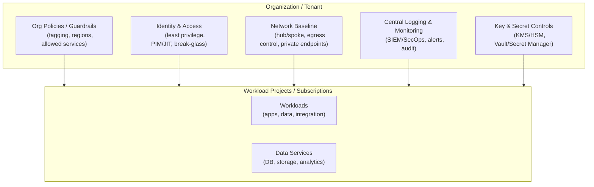
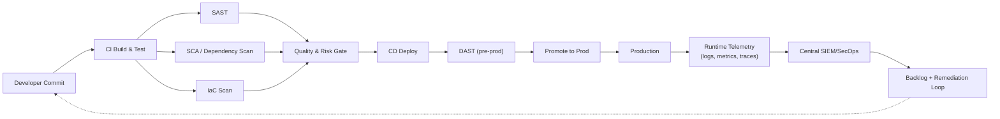
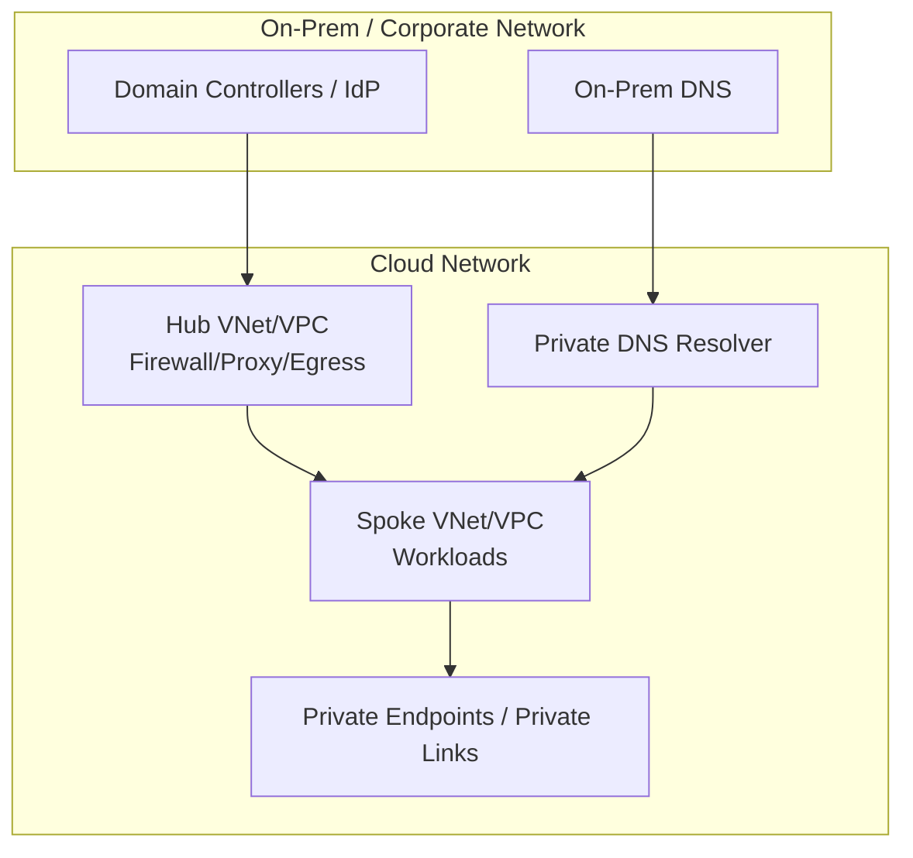
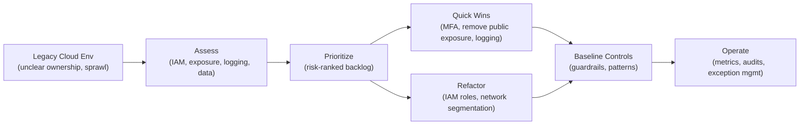

# Generic Architecture Diagrams (Reusable)

These diagrams are **generic** and safe to reuse. They are written in **Mermaid**, so GitHub renders them automatically.

---

## 1) Secure Landing Zone (Conceptual)

---

## 2) DevSecOps “Shift Left” Pipeline (Generic)

---

## 3) Hybrid DNS & Identity-Dependent Connectivity

---

## 4) Governance Recovery (Legacy → Controlled)

